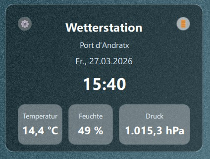
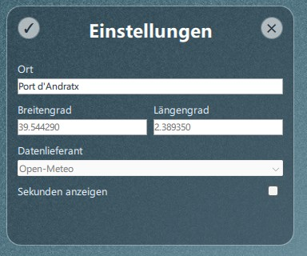

# Qt QML Weather Station

A lightweight desktop weather station built with **Qt Quick (QML)** and **C++**.
It displays current weather data from **Open-Meteo**, supports location lookup via geocoding, and persists user settings between runs.

## Main window ("Wetterstation")



## Settings window ("Einstellungen")




## 1) What does the application do?

The app is designed as a compact weather dashboard:

- Shows the title **Wetterstation**.
- Displays location, date, and current time.
- Supports time display **with** or **without seconds**.
- Shows a small weather icon based on the weather code returned by the API.
- Displays current temperature, relative humidity, and surface pressure.
- Retrieves weather data from Open-Meteo.

On startup, it restores:
- Window position,
- Last selected location and coordinates,
- Seconds-display preference.

On exit, it saves the same values.


## 2) User interactions and use cases

- **Open settings:** Button in the top-left corner opens the settings window.
- **Exit app:** Button in the top-right corner stores settings and closes the application.
- **Change location:** Enter a place name in settings. The app resolves coordinates via geocoding.
- **Review coordinates and provider:** Latitude, longitude, and provider are displayed read-only.
- **Toggle seconds display:** Enable or disable seconds in the time display.
- **Apply settings:** Save values back to the backend object and refresh weather data.
- **Cancel settings:** Close the settings window without applying changes.


## 3) Architecture overview

### Components
- **QML views**
  - `main.qml`: main weather station window and display logic.
  - `settings.qml`: settings dialog for location and display preferences.
- **Backend (C++)**
  - `WeatherStation`: weather retrieval, geocoding lookup, and state exposed to QML.
  - `AppSettings`: loading/saving persistent settings via `QSettings`.
- **Bootstrap**
  - `main.cpp`: application initialization and QML type registration.

### Data flow (location -> weather)
1. User enters a location name.
2. The app calls Open-Meteo Geocoding API to resolve latitude/longitude.
3. The resolved coordinates are used to call Open-Meteo Forecast API.
4. Returned current values are published to QML via Qt properties/signals.


## 4) File responsibilities

| File | Responsibility |
|---|---|
| `CMakeLists.txt` | Build configuration, Qt package setup, target creation. |
| `main.cpp` | App entry point, app metadata, QML registration and engine startup. |
| `main.qml` | Main weather UI, time/date display, weather values, main actions. |
| `settings.qml` | Settings UI for location and seconds-display preference. |
| `weather_station.h/.cpp` | Backend model for weather/geocoding requests and exposed properties. |
| `app_settings.h/.cpp` | Persistent settings storage and restore logic (`QSettings`). |
| `images/app_main_view.jpg` | Screenshot of the main weather window. |
| `images/app_settings_view.jpg` | Screenshot of the settings window. |
| `LICENSE` | MIT license text. |


## 5) Build and run

### Requirements
- CMake 3.16+
- C++ compiler with modern standard support
- Qt 6 (Qt Quick / QML modules)

### Commands
```bash
cmake -S . -B build
cmake --build build
```

Run the executable (single-config generators):
```bash
./build/qt_qml_weather_station
```

For multi-config generators (for example Visual Studio), run the executable from the selected configuration directory.


## Licence

This project is licensed under the terms of the [](https://opensource.org/licenses/MIT)

